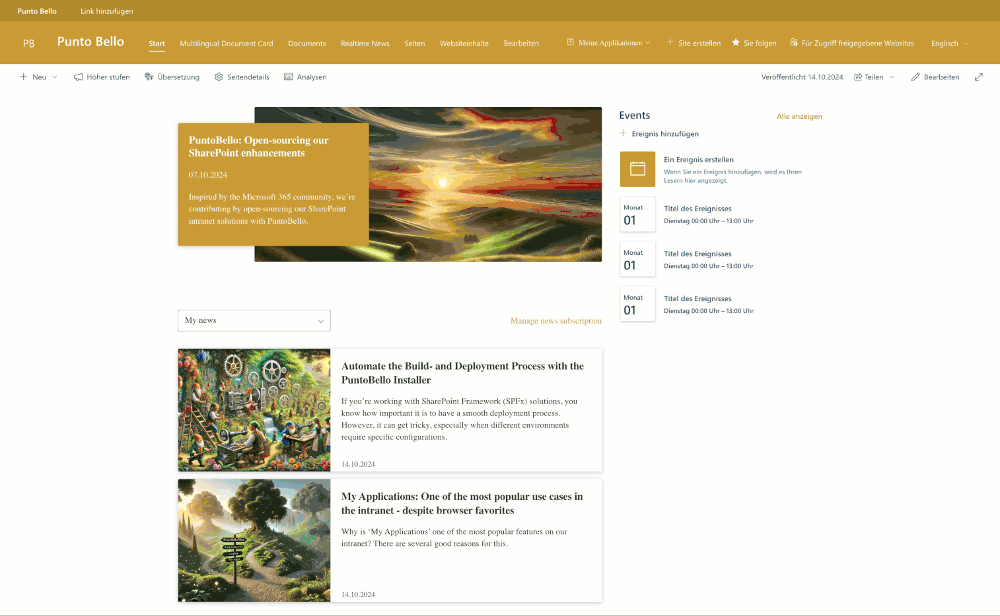
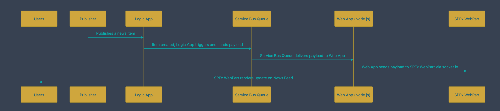

# PuntoBello Real-time News

This project demonstrates how to display SharePoint News in a custom news feed UI without relying on SharePoint Search. It also showcases how to implement near real-time functionality for updating the news feed using an Azure WebApp socket server.



## Use Case
This project is designed for scenarios where you need:
- A custom UI for rendering SharePoint news pages.
- Near real-time logic for displaying and updating SharePoint news.
- A user-based multi-channel setup to funnel news to your users based on their preferences.

## PuntoBello Artifacts
All lists and fields associated with the PuntoBello solution are prefixed with `pb_`.

## Structure
This project consists of three SharePoint SPFx solutions:
1. [PuntoBello Realtime WebApp](./puntobello-realtimenews-webapp/README.md)
2. [PuntoBello Realtime WebPart](./puntobello-realtimenews-spwp/README.md)
3. [PuntoBello Artifacts](#minimal-path-to-awesome)  
The installer will configure various artifacts to enable real-time news functionality. It will:
   - Add custom fields to your `SitePages` library.
   - Deploy a Logic App that listens for news updates in your `SitePages` library.
   - Create an Azure Service Bus, used by the Logic App to send events to the Azure WebApp.
   - Create the Azure WebApp, which acts as the receiver for publishing events and broadcasts Socket.IO events to the Realtime News WebPart.

You can find additional information in each respective repository.

## Publishing Workflow



### Explanation of the Publishing workflow:
1. **Users**: Users who are subscribed to specific channels receive the latest news in near real-time.
2. **Publisher**: The process starts when the publisher publishes a news item within SharePoint.
3. **Logic App**: Once the news item is created, a Logic App is triggered. The Logic App processes the event and sends the payload to the Service Bus Queue.
4. **Service Bus Queue**: The Service Bus Queue receives the payload from the Logic App and forwards it to the Azure Web App.
5. **Web App**: The Azure Web App, built using Node.js, processes the payload and broadcasts it to the connected SPFx WebPart using socket.io.
6. **SPFx WebPart**: The SPFx WebPart, running in the user's browser, receives the payload and updates the news feed with the new or updated content.
7. **Users**: Finally, the users see the updated news content rendered in their news feed.

## Multilinguality
All the SPFx solutions are strongly focused on serving multilingual content. Our implementation pattern differs from the standard SPFx approach to enhance SharePoint's multilingual capabilities.

For example, content is always displayed in the specific language of the page. If you have a page translated into various languages, the content on each page will be rendered in that page's language, rather than the user's language, avoiding the mixing of different languages on the same page.

### Configuring / Translating Languages
You can translate all the text by adding or updating the files in the `loc` folder. The `default.js` file should always be present to ensure a default behavior for the component.

### Rendering of Text-Based Information
Text-based information is served from the `loc` folder, as is typical in SPFx solutions. Additionally, we have implemented a default language file (`default.js`), which will always be used if the corresponding user language file is not present in the SPFx solution.

### Gathering the User Language
The current user language is retrieved in two different ways, depending on the type of SPFx solution.

#### SPFx Solutions on a SharePoint Page
Typically web parts:
The language is gathered from the current page language if running in a multilingual SharePoint configuration or from the current site language. The content will be served in this language.

#### SPFx Solutions Outside of a SharePoint Page
Typically application customizers:
The language is gathered from the current `cultureUIName` (SPFx property `pageContext.cultureInfo.currentUICultureName`).

## Additional Configuration Possibilites
Across all the PuntoBello solutions, we have put considerable effort into enabling you to configure your solutions at build time, so that you can:

- Brand the solution with your specific colors, fonts, etc.
- Deploy the solutions easily on multiple tenants if needed (e.g., dev/test/prod environments).

We have also implemented a mini framework across all solutions, which you can easily extend with additional properties if you want to configure further aspects of the solutions.

## Minimal Path to Awesome

### Puntobello Installer

[PuntoBello Installer](https://github.com/diemobiliar/puntobello-installer/) is configured as a submodule und provides a docker image containing build and deploy scripts for SPFx and SharePoint Scripts. When cloning this repository, include the submodule:

```shell
git clone --recurse-submodules https://github.com/diemobiliar/puntobello-multilingualdocument.git
```
Alternatively, configure the submodule after cloning the repository:

```shell
git submodule update --init
```

The installer and related scripts can be used in a .devcontainer, docker or locally.  These are described below:
- [Use Dev Container in VS code](#install_devcontainer)
- [Build and Deploy locally](#install_locally)

Alternatively, your own preferred method can be used to build and deploy the solutions - see the individual readme of the components.

### Azure Developer CLI

The realtime news solution depends not only on SharePoint artifacts such as sites and lists and the SPFx solution: the publishing and de-publishing of news in realtime (i.e. independently of the SharePoint search index) is dependent of logic apps. The user notifications are deliverd by a socket web app. To deploy the necessary azure resources, the Azure Developer CLI is used. To have a seamless deployment process, the scripts of the Puntobello Installer are integrated by using the Azure Developer CLI "hooks" capabilities.

To read more about the Azure Developer CLI please consult the documentation: [What is the Azure Developer CLI?](https://learn.microsoft.com/en-us/azure/developer/azure-developer-cli/overview) and [Quickstart: Deploy an Azure Developer CLI template](https://learn.microsoft.com/en-us/azure/developer/azure-developer-cli/get-started?tabs=localinstall&pivots=programming-language-nodejs).

### Prerequisites

> 📝 **NOTE:**
> The Dockerfile can be used for arm64 or amd64 CPU architectures. The architecture can be set to "arm64" or "amd64" in the devcontainer.json under build.args. The architecture can also be set using the `ARCH` argument for use with `docker build`. Only arm64 and amd64 are supported. It is set to amd64 if you don't change.

> 📝 **NOTE:**
> If the scripts are executed locally on the client and not in the Dev container, it must be ensured that the following prerequisites are installed:
> - Prerequisites for building SPFx solutions
> - Azure Developer CLI, Terraform and Az CLI
> - The corresponding PowerShell modules

> 💡 **TIP:**
> In order to use the scripts, configure the desired login mechanism and other parameters in `./.devcontainer/scripts/config.psm1`. Every authentication mechanism is based on the PnP.PowerShell examples. For setting up an Entra ID app registration and its corresponding API permissions, as well as the necessary permissions when using a user, consult the documentation: [Connect-PnPOnline](https://pnp.github.io/powershell/cmdlets/Connect-PnPOnline.html) and [Authentication](https://pnp.github.io/powershell/articles/authentication.html).

> ⚠️ **Caution:** Never commit files containing secrets or passwords!

### <a id="install_devcontainer"></a>Use Dev Container in VS code
The Visual Studio Code Dev Containers extension lets you use a container as a full-featured development environment.

> 💡 **TIP:**
> If you're interested in getting started with dev containers, you may find this [Dev Containers tutorial](https://code.visualstudio.com/docs/devcontainers/tutorial) helpful. It provides step-by-step instructions to help you get up and running quickly.

To perform a fully automated installation of the entire solution, the following steps are required:

1. Use Ctrl + Shift + P (on Windows) or Command + Shift + P (on OS X) to run `Dev Containers: Rebuild and Reopen in Container`.
This builds the container and attaches the project folder to the container with PowerShell, modules and Azd loaded.

2. Run `azd auth login` and `az login` and use an account which has the rights in your Azure tenant to create resources in the selected subscription. It is possible to use same authentication parameters which you already set in the `config.psm1`. For example: to use app id and app secret of login method 1, you can use following commands:

```powershell
Import-Module "/usr/local/bin/config.psm1" -Force -DisableNameChecking

azd auth login --client-id $global:appId --client-secret $global:appSecret --tenant-id "<set_your_tenant_id>"

az login --service-principal -u $global:appId -p $global:appSecret --tenant "$($global:M365_TENANTNAME).onmicrosoft.com"
```

3. Run `azd env new "dev" --location "switzerlandnorth" --subscription "00000000-0000-0000-0000-000000000000"` to create a new environment to use with azd. 
   `--subscription` is the Name or the ID of an Azure subscription to use for the new enfiornment. 
   `--location` defines the Azure locatin for the new environment. 
   The configuration created will be set in folder `.azure`. 

4. To start the installation run `azd up`. This will run the process definied in the file [`azure.yaml`](./azure.yaml). First it will run the scrip [`preup.ps1`](./hooks/preup.ps1), which is basically an implementation around the script `Deploy-SitesAndLists.ps1` of the PuntoBello Installer. The script also reads parameters from solutions.json file in folder `spo` and set environment variables to use in the futher installation process. Next all Azure resources including the socket webapp and logic apps are created. For postprocessing there is the script [`postup.ps1`](./hooks/postup.ps1), which builds and deploys the SPFx webpart based on the PuntoBello Installer using various parameters from the preceding steps.

5. After successfully running `azd up` all required Azure resources are deployed, the SPFx webpart 'puntobello-realtimenews-spwp' is built and installed on the site configured in [`solutions.json`](./spo/solutions.json). For the solution to work, the following manual steps are required to complete the installation:
    * Authenticate the API connection for SharePoint in your Azure resource group. Please make sure the account has access to the news sites and lists which are relevant to complete the realtime news publishing process.
    * Add Terms in the Termgroup "PuntoBello", Termset "Channel" to configure News Channels. At least one Channel is required.

### <a id="install_locally"></a>Build and Deploy locally

To use the installation process without a Dev container, the same procedure as for installation within the Dev container is generally used. It must be ensured that all necessary tools are already pre-installed.

1. Run `azd auth login` and `az login` and use an account which has the rights in your Azure tenant to create resources in the selected subscription.

2. Run `azd env new` to create a new environment to use with azd. The configuration created will be set in folder `.azure`. During the installation process you also have to set the Azure subscription and Azure location to use.

3. To start the installation run `azd up`. This will run the process definied in the file [`azure.yaml`](./azure.yaml). First it will run the script [`preup.ps1`](./hooks/preup.ps1), which is basically an implementation around the script `Deploy-SitesAndLists.ps1` of the PuntoBello Installer. The script also reads parameters from solutions.json file and set environment variables to use in the futher installation process. Next all Azure resources including the socket webapp and logic apps are created. For postprocessing there is the script [`postup.ps1`](./hooks/postup.ps1), which builds and deploys the SPFx webpart based on the PuntoBello Installer using various parameters from the preceding steps.

4. After successfully running `azd up` all required Azure resources are deployed, the SPFx webpart 'puntobello-realtimenews-spwp' is built and installed on the site configured in [`solutions.json`](./spo/solutions.json). For the solution to work, the following manual steps are required to complete the installation:
    * Authenticate the API connection for SharePoint in your Azure resource group. Please make sure the account has access to the news sites and lists which are relevant to complete the realtime news publishing process.
    * Add Terms in the Termgroup "PuntoBello", Termset "Channel" to configure News Channels. At least one Channel is required.

## Authors

* **Nicole Beck Dekkara** - [PuntoBello](https://www.puntobello.ch/)
* **Mattias Bürgi** - [PuntoBello](https://www.puntobello.ch/)
* **Fabian Hutzli** - [PuntoBello](https://www.puntobello.ch/)
* **Nello D'Andrea** - [PuntoBello](https://www.puntobello.ch/)

## Credits
This project is based on the concepts of the sample [react-realtime](https://github.com/pnp/sp-dev-fx-webparts/tree/main/samples/react-real-time) created by [Franck Cornu](https://github.com/FranckyC)
Thank you for the inspiration !

## License

This project is licensed under the MIT - see the [LICENSE.md](LICENSE.md) file for details

## Acknowledgment Request

If you find this software useful and incorporate it into your own projects, especially for commercial purposes, we kindly ask that you acknowledge its use. This acknowledgment can be as simple as mentioning "Powered by Die Mobiliar - PuntoBello" in your product's documentation, website, or any related materials.

While this is not a requirement of the MIT License and is entirely voluntary, it helps support and recognize the efforts of the developers who contributed to this project. We appreciate your support!