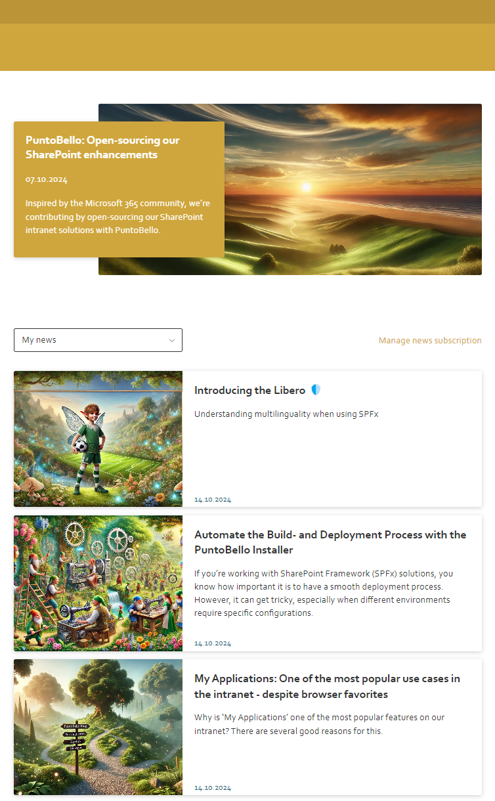
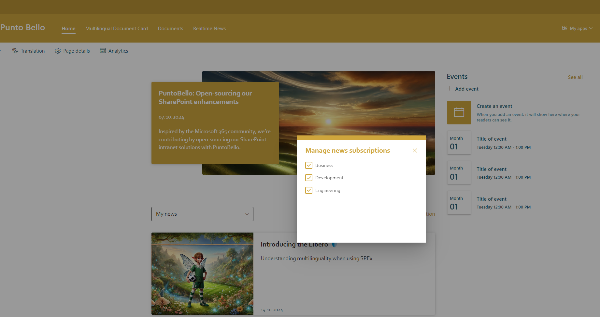

# PuntoBello Realtime News Webpart

## Summary
This webpart displays SharePoint News with a custom UI based on users' preferred channel subscriptions. The news is shown and updated in near real-time.

**News Feed**  

**Channel Management & Subscription**

### Features
The webpart includes the following features:
- Displays news in a custom format, with a configurable number of news items shown through webpart properties.
- Shows one sticky news item, which is prominently displayed at the beginning of the news feed.
- Filters news by channels.
- Manages user preferences for channel subscriptions.

### Data Sources
The following data sources are used by the webpart:
- The `Realtime News` list, where the news items reside and are rendered by the webpart.
- The `Subscribed Channels` list, where user channel subscriptions are stored. Users can manage their subscription preferences directly in the webpart.
- A termstore group where the list of channels is stored.
- A socket server where the webpart connects and listens to events such as "a new news item is available" or "a news item has been updated."

### Realtime News List
All of these fields are automatically generated or updated through the [PuntoBello Realtime News Installer](../README.md#minimal-path-to-awesome). The following list is for documentation purposes only. You should not modify list items directly.

| Fieldname      | Fieldtype              | Description                                                                 |
|----------------|------------------------|-----------------------------------------------------------------------------|
| Sticky         | Boolean                | Defines if this item represents a sticky news item. Only one sticky news item is allowed.|
| Sticky date    | Datetime               | Date until the sticky news item will be displayed.                           |
| Language       | Single Line of Text     | Language code, either in locale format (ab_CD) or LCID.                      |
| Image url      | Link or Image           | URL of the image.                                                           |
| Header         | Multiple Lines of Text  | Header text that will be displayed.                                         |
| News url       | Link or Image           | URL of the news post.                                                       |
| Page name      | Single Line of Text     | Name of the page associated with the news item.                             |
| Channels       | Single Line of Text     | Channels associated with this news item.                                    |
| Published from | Date and Time           | Start date to determine if the news item should be displayed.               |
| Published to   | Date and Time           | End date to determine if the news item should be displayed.                 |

### Subscribed Channels List
All of these fields are automatically generated or updated by the webpart.

| Fieldname  | Fieldtype   | Description                                           |
|------------|-------------|-------------------------------------------------------|
| Subscribed | Person/Group| The user to whom this setting belongs.                |
| Channels   | Metadata    | The subscribed channels.                              |

### Termstore for Channels
Channels are defined in the SharePoint termstore to ensure multilingual support across the solution.

### Webpart Socket Server
This webpart automatically connects with a socket server (URL is defined in the webpart parameters). The socket server emits various events, which are ingested by the webpart. This implementation ensures the following events are processed:
- `New news`: Displays a popup that draws the user's attention and allows them to refresh the news feed.
- `Update news`: Updates the news feed directly. The implementation dispatches the reads over a 30-second timespan to prevent overwhelming the SharePoint service with requests.

### Newsfeed Rendering Logic
The news items are queried using various parameters:
1. **Language Code**: The webpart shows news according to the language code set in the webpart property.
2. **Channels/Location**: News items may belong to multiple channels and address specific locations. Channels and locations can also be targeted hierarchically. The webpart ensures relevant news is displayed.
3. **Publishing Datetime**: From/to dates to determine whether a news item should be shown.
4. **Termstore Cache**: Termstore data is cached for 12 hours to improve performance.

### _Note_
- Uses PnP-JS library for all REST interactions with SharePoint.

### Parameters
You can configure all parameters in the corresponding files located in the `env` directory. Once set, build the solution accordingly.

| Parameter                           | Description                                                              |
|-------------------------------------|--------------------------------------------------------------------------|
| SPFX_URL_SOCKET                     | URL for the socket connection used for real-time communication.          |
| SPFX_TIMEOUT_IN_MS_SOCKET           | Timeout setting in milliseconds for socket connections.                  |
| SPFX_LIST_TITLE_SUBSCRIBEDCHANNELS   | Title of the list containing subscribed channels.                        |
| SPFX_LIST_ID_REALTIMENEWSLIST        | ID of the list used for real-time news.                                  |
| SPFX_PATH_REALTIMENEWSLIST           | Path to the real-time news list.                                         |
| SPFX_TERMSTORE_CHANNEL_GUID          | GUID for the term store channel.                                         |
| SPFX_COLOR_TEXT                     | Primary color used for text throughout the application.                  |
| SPFX_COLOR_TEXT_BRIGHTNESS_DARK      | Darker brightness adjustment for text color. Should be less than 1.      |
| SPFX_COLOR_STICKY_TEXT              | Color used for text in sticky elements.                                  |
| SPFX_COLOR_PRIMARY                  | Primary color used throughout the application.                           |
| SPFX_COLOR_PRIMARY_BRIGHTNESS_DARK   | Darker brightness adjustment for the primary color. Should be less than 1.|
| SPFX_BORDER_RADIUS                  | Radius for rounding the corners of elements.                             |
| SPFX_FONT_FAMILY                    | Font family used across the application.                                 |
| SPFX_FONT_SIZE_GENERIC              | Standard font size for general text.                                     |
| SPFX_FONT_SIZE_TITLE                | Font size for titles and headings.                                       |
| SPFX_CARD_BOX_SHADOW                | Box shadow styling for card elements.                                    |
| SPFX_CARD_BOX_SHADOW_HOVER          | Box shadow styling for card elements when hovered.                       |
| SPFX_SYSTEM_MESSAGE_BOX_SHADOW      | Box shadow styling for system message elements.                          |

## SharePoint Framework Version

## Solution

Solution | Author(s)
---------|-----------
puntobello-realtimenews-spwp | Nello D'Andrea, die Mobiliar

## Version History

Version | Date        | Comments
--------|-------------|---------
1.3.0   | January 2026 | Upgraded to SPFx 1.22.1
1.2.0   | July 2025 | Upgraded with Pantoum SPFx AI Upgrader
1.1.0   | July 2025 | Upgraded with Pantoum SPFx AI Upgrader
1.0.0   | October 2024| Initial release

## License
[MIT License](../LICENSE.md)

## Acknowledgment Request
If you find this software useful and incorporate it into your own projects, especially for commercial purposes, we kindly ask that you acknowledge its use. This can be as simple as mentioning "Powered by Die Mobiliar - PuntoBello" in your product's documentation, website, or any related materials.

While this is not a requirement of the MIT License and is entirely voluntary, it helps support and recognize the efforts of the developers who contributed to this project. We appreciate your support!